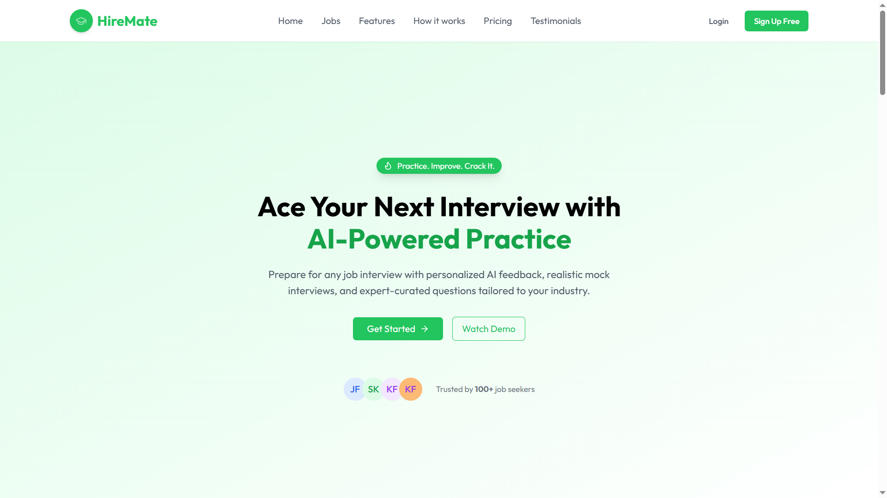

# 🚀 HireMate

**HireMate** is an AI-powered full-stack web application designed to help users prepare for job interviews through realistic mock sessions. It features AI interviewers tailored to job roles, progress tracking, and detailed post-interview feedback — all in one place.

## 🌐 Live Demo

<a href='https://hiremate-by-karan.vercel.app'> 
    
    </img>
</a>

---

## ✨ Features

- 🔐 **Advanced Authentication** with OTP verification  
- 🧠 **AI-Powered Voice Interviews** using VAPI Agent  
- 📊 **Detailed Interview Feedback** with scoring and suggestions  
- 🛠️ **Admin Dashboard** to manage job listings (Add / Update / Delete)

---

## 💻 Tech Stack

**Frontend:** React, Tailwind CSS  
**Backend:** Node.js, Express.js  
**Database:** MongoDB  
**AI Integration:** VAPI AI, OpenAI

---

## ⚙️ Installation

### 1. Clone the repository

```bash
git clone https://github.com/your-username/HireMate.git
cd hiremate

cd Backend
npm install
npm run dev

cd ../Frontend
npm install
npm run dev
```

⚙️ Environment Variables
---
To run this project, you will need to add the following environment variables to your .env files

**Backend (.env)**

```
PORT=your_port

DB_URL=your_mongodb_connection_string

JWT_SECRET=your_jwt_secret

CLOUD_NAME=your_cloudinary_cloud_name

API_KEY=your_cloudinary_api_key

API_SECRET=your_cloudinary_api_secret

FRONTEND_URL=your_frontend_url

ADMIN_PASS=admin_password

ADMIN_ID=admin_id

MAIL_USER=your_email_address

MAIL_PASS=your_email_password

ADMIN_URL=your_admin_url
```

**Frontend (.env)**

```
VITE_BACKEND_URL=your_backend_api_url

VITE_VAPI_API_KEY=your_vapi_api_key

VITE_VAPI_AGENT_ID=your_vapi_agent_id

VITE_OPENROUTER_API_KEY=your_openrouter_api_key
```